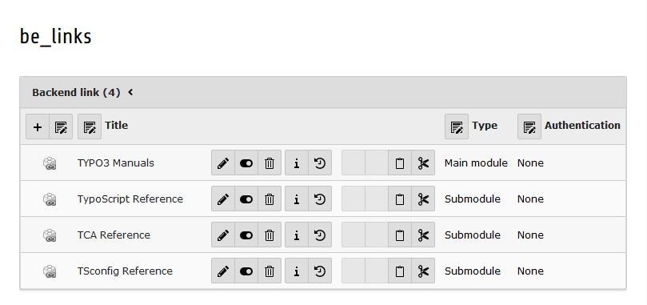
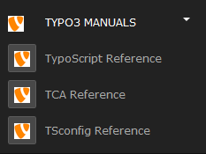

.. ==================================================
.. FOR YOUR INFORMATION
.. --------------------------------------------------
.. -*- coding: utf-8 -*- with BOM.

.. include:: ../Includes.txt

What does it do?
================

The extension allows you to add external links as own backend modules.

There is no need to write any PHP line nor have any knowledge about module registration in TYPO3.

    This is an overview of some module records.

These module records are added as own modules to your TYPO3 installation.

    Added backend modules according to their records.
