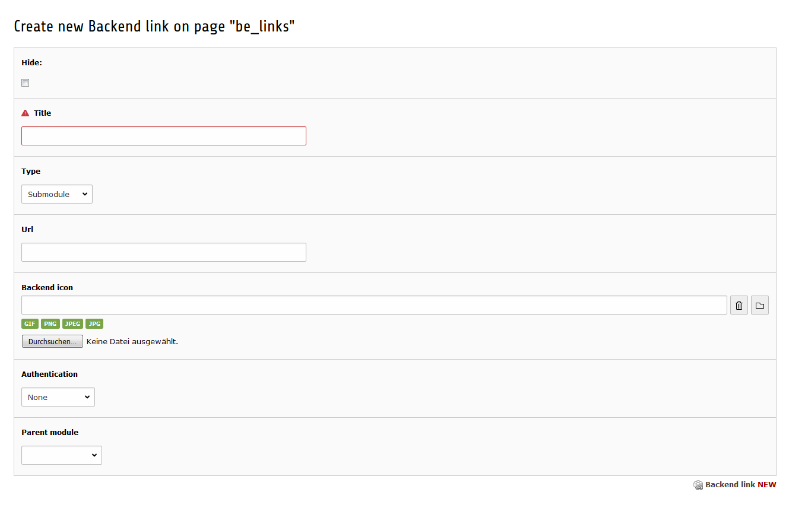

.. ==================================================
.. FOR YOUR INFORMATION
.. --------------------------------------------------
.. -*- coding: utf-8 -*- with BOM.

.. include:: ../Includes.txt

.. _user-manual:

User Manual
====================

Installation
------------

Install this extension with the extension manager and make sure it is activated. No further configuration is needed.

Usage
-----

#. Create a new page of type "Folder" for your module records
#. Change to the Web / List module and select the folder
#. Create a new record of type "Backend link"

    Insert a new module record in your folder.

Module record
"""""""""""""

.. t3-field-list-table::
 :header-rows: 1

 - :Field:
        Field:
   :Description:
        Description:
 - :Field:
        Hide
   :Description:
        Enable or disable the module record
 - :Field:
        Title
   :Description:
        Required! The module title which is shown in the module list
 - :Field:
        Type
   :Description:
        Define if this module is a main or a sub module
 - :Field:
        Url
   :Description:
        Enter the url which should be shown as module content
 - :Field:
        Backend icon
   :Description:
        Add an image as module icon
 - :Field:
        Authentication
   :Description:
        Define the authentication type of this module
        - None: the module is shown for everyone
        - User & Group: the module access can be defined in user and group records
        - Admin only: the module is visible only for admins
        - User: the module access can be defined in user records
        - Group: the module access can be defined in group records
 - :Field:
        Parent module
   :Description:
        Define the main module where this module should be attached to
